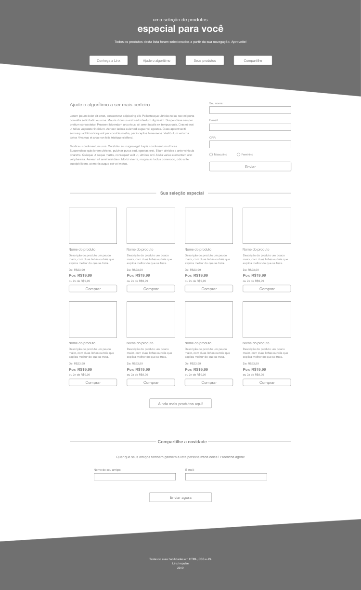
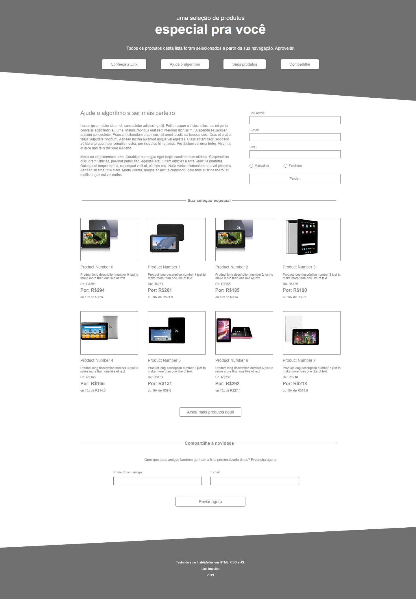
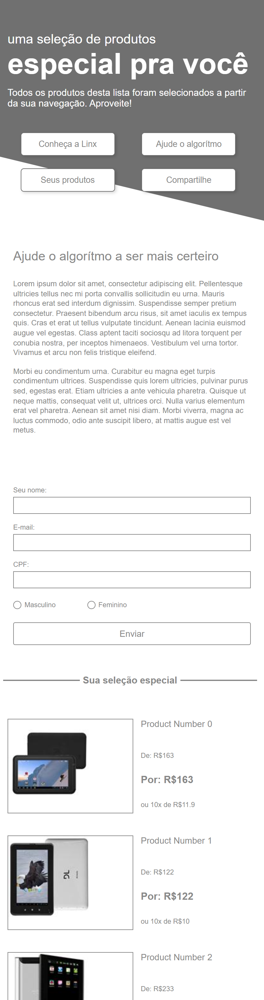

# Teste: Landing-page 

## Teste para vaga de emprego: Desenvolvedor Júnior
 

O objetivo do desafio era reproduzir o design proposto e tornar os formulários e botão para carregamento d emais produtos funcionais

 

<h1>Regras para o desafio:</h1>
<ul>
<li>Utilizar apenas HTML, CSS e JS puro</li>
<li>Impedir o envio dos formulários caso os dados não tenham sido preenchidos</li>
<li>Carregar novos produtos quando clicar no botão "Ainda mais produtos aqui!"</li>
<li>Design responsivo para Desktop e Mobile com width máx = 420px</li>
</ul>
  

## Design proposto
 

Layout desktop

Layout Mobile

  

<h1>Desafio concluído</h1>
 

Layout desktop concluído

 

Layout mobile concluído

  

<h1>Live preview da página</h1>
<a href="https://isabeiro.github.io/landing-page/">Live Preview Landing Page</a>
  

<h1>Conclusões</h1>
 

Pratiquei bastante HTML, CSS e JavaScript, utilizei SASS para otimizar a execução do código CSS. No JavaScript realizei a consulta de uma API para os produtos exibidos do site e também realizei a conferencia dos formulários antes do envio.

Foi um desafio pessoal construir toda a estrutura do projeto sozinha, do design até as funcionalidades, e procurei manter os códigos limpos e bem organizados.
 
